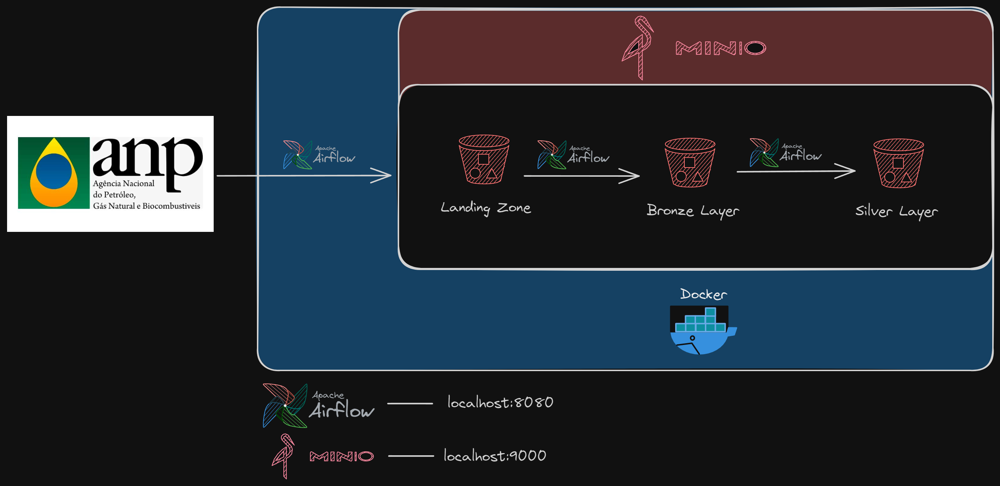
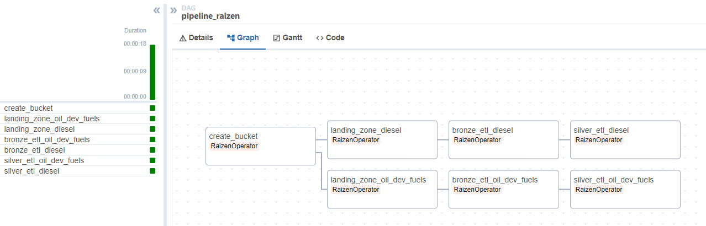
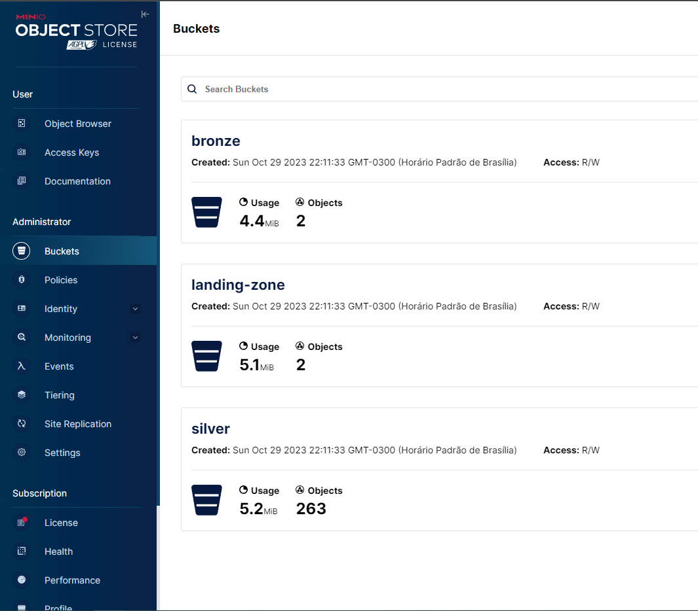

# _**Engenharia de Dados**_

>## UP 🚀
- ```docker-compose -f pipeline.yaml up```

<br>

>## Folders 📕
- | dags : pasta pareada com o container 
  - | operators : operadores custom do airflow
  - | scripts : python functions
    - | static : arquivo estático json
- | data : pasta pareada com o container
- | images : imagens para o md
- | logs : pasta pareada com o container
- | notebooks : análise exploratória de dados da última camada após execução do pipe
- | .env : variáveis de ambiente
- | .gitignore : arquivos fora do versionamento
- | pipeline.yaml : arquivo de marcação para subida dos containers
- | requirements.txt : arquivo para instalar as libs para desenvolvimento 

<br>

>## Arquitetura 📐


<br>

>## Pipeline 🔩

- **create_bucket**: criação dos buckets para o lake
- **landing_zone_diesel**: captura os dados das vendas pelas distribuidoras de óleo diesel no portal da ANP
- **landing_zone_oil_dev_fuels**: captura os dados das vendas pelas distribuidoras dos derivados de combustivel de petróleo no portal da ANP
- **bronze_etl_diesel**: transformações dos dados de acordo com a solicitação do teste para o dataframe de óleo diesel e armazena na camada bronze
- **bronze_etl_oil_dev_fuels**: transformações dos dados de acordo com a solicitação do teste para o dataframe de derivados de combustiveis de petróleo e armazena na camada bronze
- **silver_etl_diesel**: criação das partições e as indexações de acordo com a solicitação do teste para o dataframe de óleo diesel e armazena na camada silver
- **silver_etl_oil_dev_fuels**: criação das partições e as indexações de acordo com a solicitação do teste para o dataframe de derivados de combustiveis de petróleo e armazena na camada silver



<br>

>## Buckets 📦
- **landing-zone**: criação dos buckets para o lake
  - oil-derivatives-fuels.csv
  - diesel.csv
- **bronze**:
  - oil-derivatives-fuels.csv
  - diesel.csv
- **silver**:
  - year
    - month
      - part-0001.csv



<br>

>## Notebooks 💻

